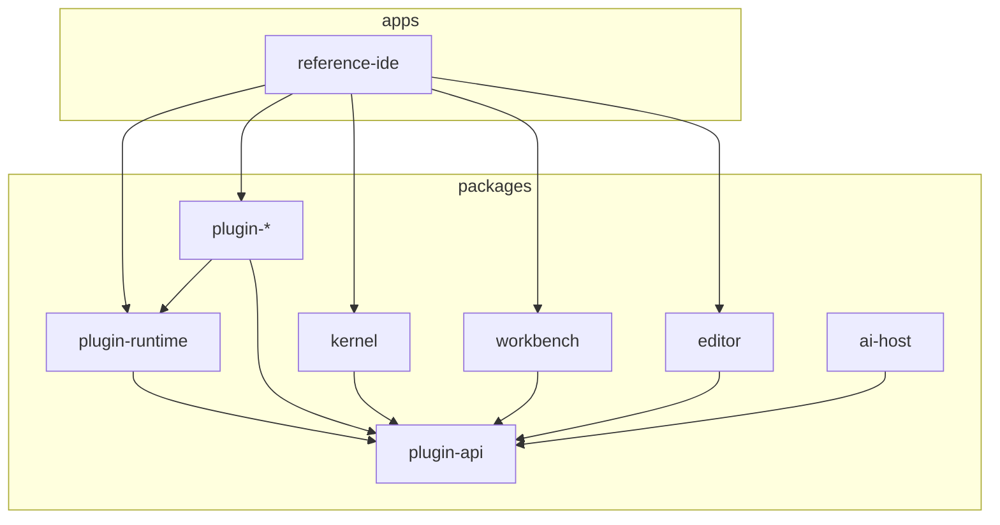
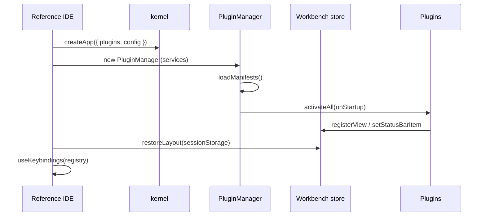
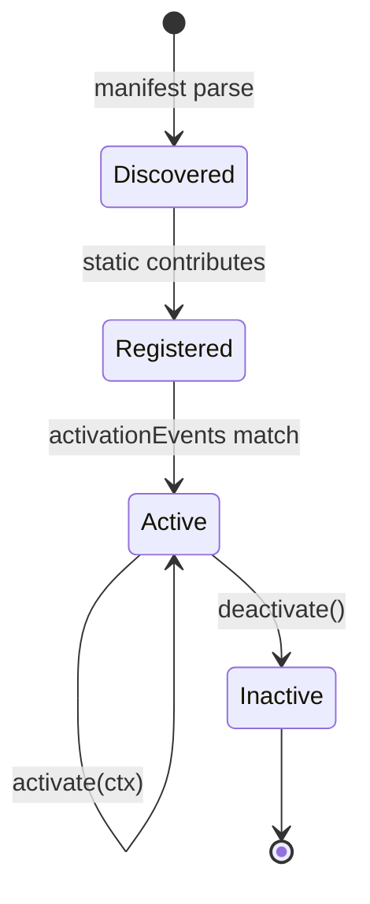
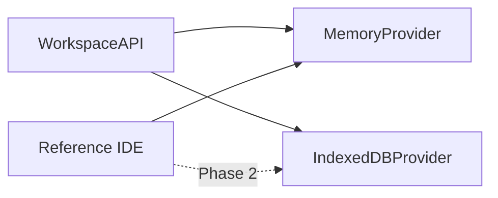
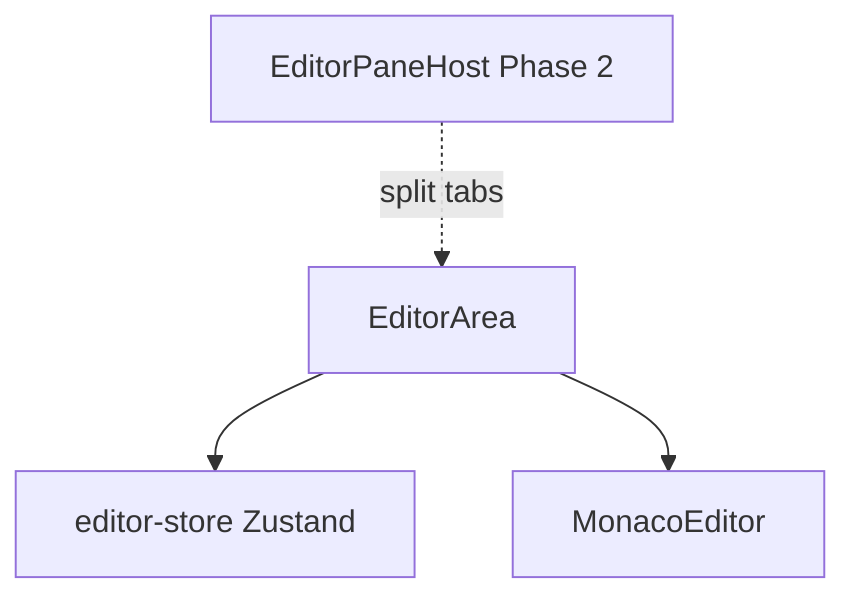
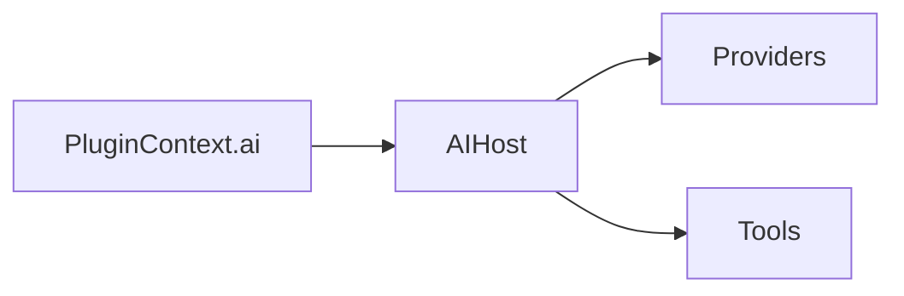

# Molecule Next — Design Roadmap

> **中文摘要**：Molecule Next 是插件优先的 Web IDE 框架（`@easyspace/*`），Reference IDE 为展示应用。本路线图对标 Pyxis-CodeCanvas 与 legacy Molecule，分 Phase 0–4 推进：Phase 1 已完成百分比布局、快捷键注册、设置持久化；Phase 2 计划 IndexedDB 工作区、配置服务、编辑器分屏；Phase 3–4 为 Git、终端、扩展市场与 i18n。

---

## 1. Vision & positioning

### Framework vs product

| Layer | Role | Location |
|-------|------|----------|
| **Framework** | Reusable packages: kernel, workbench, editor, plugin-api, plugin-runtime, ai-host | `packages/*` |
| **Official plugins** | Explorer, search, themes, AI, panel — same contract as third-party | `packages/plugins/*` |
| **Reference IDE** | End-to-end showcase; not the only consumer | `apps/reference-ide` |
| **Legacy Molecule** | Read-only reference | repository root `src/` |

Molecule Next optimizes for **embeddability** and **AI-era extensibility**. Pyxis-CodeCanvas optimizes for **standalone iPad-first IDE** with full filesystem/Git/terminal. We borrow patterns, not the monolith.

### Design principles

1. Plugins never import kernel internals — only `@easyspace/plugin-api` facades.
2. Static contributions (views, commands, themes) register at load; `activate()` is deferred.
3. Host apps own persistence strategy; framework exposes contracts.
4. Minimal diffs per phase; acceptance criteria gate merges.

---

## 2. Capability matrix

| Capability | Legacy Molecule `src/` | Molecule Next | Pyxis-CodeCanvas |
|------------|------------------------|---------------|------------------|
| Workbench layout | Built-in slots | `@easyspace/workbench` + Zustand | Custom flex + % panes |
| Plugin system | `IExtension` | `PluginModule` + Zod manifest | esbuild npm extensions |
| Editor | Monaco override stack | `@easyspace/editor` adapter | Monaco + diff tabs |
| Workspace | Host-provided | Memory (Phase 1) | IndexedDB FS |
| Git / SCM | N/A | Planned plugin | isomorphic-git |
| Terminal | N/A | Planned plugin | Node emulator + xterm |
| Search | Basic | Sync in-memory | Web Worker + globs |
| Settings | Molecule settings service | localStorage + session layout | `.pyxis/settings.json` |
| Keybindings | Monaco KeybindingService | Registry + hook (Phase 1) | Full chord + persistence |
| AI | N/A | `@easyspace/ai-host` | AI diff adoption |
| i18n | Locales extension | Phase 4 | 18 languages |
| E2E | Limited | Playwright Reference IDE | Vitest + Playwright |

---

## 3. Target architecture

### Package map



### Data flow (startup)



### Plugin lifecycle



### Workspace layer (target)



### Editor host (target)



### AI host



---

## 4. Phased roadmap

### Phase 0 — Foundation (done)

| Deliverable | Package | Acceptance |
|-------------|---------|------------|
| Monorepo + Turbo | root | `pnpm build` green |
| Plugin manifest Zod | plugin-api | Invalid manifest rejected |
| PluginManager | plugin-runtime | Unit tests pass |
| Workbench shell | workbench | E2E workbench visible |
| Reference IDE | apps/reference-ide | Explorer + Monaco + AI mock |

### Phase 1 — Quick wins (this session)

| Deliverable | Owner | Acceptance |
|-------------|-------|------------|
| % pane resize + touch | workbench | Drag sashes; min % enforced; RAF smooth |
| Layout persistence | reference-ide + workbench | `sessionStorage molecule:layout` restore |
| Theme persistence | reference-ide + plugin-themes | `localStorage molecule:theme` restore |
| Keybinding registry | plugin-runtime + plugin-commands | Default chords fire commands |
| Configuration schema stub | plugin-api | Zod validates manifest.configuration |
| DESIGN-ROADMAP + ADR 004 | docs | Linked from README-NEXT |

### Phase 2 — Workspace & configuration

| Deliverable | Owner | Acceptance |
|-------------|-------|------------|
| `WorkspaceProvider` indexeddb | new plugin or runtime | Files survive reload |
| `ConfigurationService` | plugin-api + runtime | Read/write user + workspace settings |
| Editor split (`EditorPaneHost`) | editor + workbench | Two editors side-by-side |
| Search worker | plugin-search | Non-blocking search on 1k+ files |
| Settings UI expansion | plugin-themes | Edit persisted prefs |

**Acceptance:** Open Reference IDE → edit file → reload → content + layout restored.

### Phase 3 — SCM & terminal (optional plugins)

| Deliverable | Owner | Acceptance |
|-------------|-------|------------|
| `ScmAPI` + git plugin | plugin-git (new) | Stage/commit in memory repo |
| `TerminalAPI` + terminal plugin | plugin-terminal (new) | xterm panel runs shell or emulator |
| Panel output streaming | plugin-panel | Structured log channels |

**Acceptance:** Git status in status bar; terminal opens in panel.

### Phase 4 — Product polish (in progress)

| Deliverable | Owner | Acceptance |
|-------------|-------|------------|
| Tab session restore | editor + reference-ide | `sessionStorage molecule:tab-session`; E2E reload keeps tabs |
| Search regex toggle | plugin-search | `search.useRegex` → worker |
| Keybinding editor MVP | plugin-themes | Editable overrides + JSON import/export |
| Workspace switcher | plugin-runtime IDB roots | Menubar switch/new project |
| SCM git MVP | plugin-scm | `.molecule/git.json` snapshot (browser; not full isomorphic-git) |
| Extension loader | plugin-runtime | `public/extensions/*` ESM dynamic import |
| i18n stub | plugin-api `l10n` | `t(key)` + hello plugin sample strings |
| i18n plugin (full) | plugin-i18n | EN + ZH UI strings — deferred |
| AI diff adoption | plugin-ai + editor | Accept/reject hunks — deferred |
| Accessibility audit | workbench | WCAG 2.2 AA critical paths — deferred |

### Phase 6 — Git, terminal, AI production, extensions, i18n (current)

| Deliverable | Owner | Acceptance |
|-------------|-------|------------|
| `@easyspace/git` | packages/git | isomorphic-git via WorkspaceAPI FS; unit tests |
| `@easyspace/terminal-host` | packages/terminal-host | Built-in shell commands; TerminalAPI adapter |
| `plugin-scm` upgrade | plugin-scm | Real stage/commit/log; migrate `git.json` |
| AI OpenAI-compatible provider | ai-host | Settings key; mock default; multi-file edits |
| Extension registry | plugin-runtime + build script | Zod manifest; `sample-panel` extension |
| i18n expansion | plugin-i18n | en, zh-CN, ja; extension localizations |
| ADR 005 | docs | Package boundaries documented |

**Deferred:** Tauri desktop shell, full Pyxis terminal emulator, extension signing/marketplace.

### Phase 5 — Session, UX, i18n, AI edits (done)

| Deliverable | Owner | Acceptance |
|-------------|-------|------------|
| Session durability | editor + workspace | `.molecule/session.json` debounced; load workspace first, fallback `sessionStorage` |
| Workspace UX | reference-ide | Status bar root; `workbench.selectWorkspace` quick pick |
| i18n plugin | plugin-i18n | EN/ZH menubar + settings menu; locale in settings |
| AI diff MVP | ai-host + plugin-ai | Mock `suggest edit` → Accept writes file |
| SCM commit log | plugin-runtime scm | `commits[]` in `.molecule/git.json` |
| Extension build | `scripts/build-extensions.mjs` | See `docs/EXTENSIONS.md` |
| Accessibility basics | workbench | aria-labels, focus trap palette, tab `aria-selected` |

---

## 5. API proposals (plugin-api extensions)

### WorkspaceProvider

```typescript
type WorkspaceBackend = 'memory' | 'indexeddb';

interface WorkspaceProviderFactory {
  create(options: { root: string; backend: WorkspaceBackend }): WorkspaceAPI;
}
```

- **Phase 1:** `createMemoryWorkspace(files)` (existing)
- **Phase 2:** `createIndexedDbWorkspace({ root: '/project' })`

### ConfigurationService

```typescript
interface ConfigurationService {
  get<T>(key: string, defaultValue?: T): T;
  update(key: string, value: unknown): Promise<void>;
  onDidChangeConfiguration(handler: (e: { key: string }) => void): Disposable;
}
```

- User scope: `localStorage` / host sync
- Workspace scope: `.molecule/settings.json` (Phase 2)

Manifest contribution (stub in Phase 1):

```typescript
configuration: {
  'myPlugin.enabled': { type: 'boolean', default: true }
}
```

### KeybindingService

```typescript
interface KeybindingContribution { command: string; key: string; when?: string }

interface KeybindingService {
  registerKeybinding(binding: KeybindingContribution): Disposable;
  getKeybindings(): KeybindingContribution[];
}
```

Phase 1: `KeybindingRegistry` in plugin-runtime + `useKeybindings` hook.

### EditorPaneHost (split)

```typescript
interface EditorPaneHost {
  split(direction: 'horizontal' | 'vertical'): void;
  closePane(paneId: string): void;
  getLayout(): EditorPaneLayout;
}
```

Phase 2; inspired by Pyxis tab groups, decoupled from Monaco internals.

### ScmAPI (optional Git plugin)

```typescript
interface ScmAPI {
  getRepositories(): ScmRepository[];
  stage(path: string): Promise<void>;
  commit(message: string): Promise<void>;
  onDidChange(handler: () => void): Disposable;
}
```

### TerminalAPI (optional)

```typescript
interface TerminalAPI {
  createTerminal(options?: { name?: string; cwd?: string }): TerminalSession;
  onDidCloseTerminal(handler: (id: string) => void): Disposable;
}
```

---

## 6. Pyxis borrow list

| Pyxis asset | Action | Notes |
|-------------|--------|-------|
| `usePaneResize.ts` | **Port pattern** | RAF + touch + min % → workbench |
| IndexedDB FS | **Reimplement** | Via WorkspaceProvider; don't copy engine |
| isomorphic-git | **Optional plugin** | Phase 3 |
| Node emulator + xterm | **Skip core** | Terminal plugin only if needed |
| Search worker + globs | **Reimplement** | plugin-search Phase 2 |
| `.pyxis/settings.json` | **Adapt** | `.molecule/settings.json` |
| Extension esbuild loader | **Phase 4** | Align with plugin manifest |
| 18 i18n | **Defer** | plugin-i18n Phase 4 |
| AI diff UI | **Inspire** | plugin-ai + editor Phase 4 |
| Keybinding persistence UI | **Phase 2** | After ConfigurationService |
| iPad touch targets | **Selective** | Touch on sashes Phase 1 |

---

## 7. Migration notes (Reference IDE today)

### Current state (pre–Phase 1)

- Fixed px sidebar (260), panel (200), auxiliary (360)
- Command palette shortcut only in `CommandPaletteHost`
- Theme picker Ctrl+K in `ThemePickerHost` only
- No layout/theme restore on reload
- In-memory workspace from `SAMPLE_WORKSPACE`

### After Phase 1

1. Layout dimensions are **percentages** in workbench store; persisted to `sessionStorage['molecule:layout']`.
2. Theme id in `localStorage['molecule:theme']`; applied before plugin activation.
3. Central `useKeybindings` handles workbench chords; remove duplicate listeners over time.
4. `README-NEXT.md` links here and ADR 004.

### Host integration checklist

```typescript
// On mount (MoleculeIDE)
restorePersistedLayout(useWorkbenchStore.getState());
applyTheme(getPersistedThemeId());

// On change
subscribeLayoutPersistence(useWorkbenchStore);
subscribeThemePersistence();
```

### Breaking changes (minor)

- `sidebarWidth` / `panelHeight` / `auxiliaryWidth` store fields now hold **percent (0–100)**, not pixels. External code assuming px must update.

---

## Related documents

- [ADR 001: Monorepo](adr/001-monorepo-and-packages.md)
- [ADR 002: Plugin system](adr/002-plugin-system.md)
- [ADR 003: AI Host](adr/003-ai-host.md)
- [ADR 004: Workspace & settings](adr/004-workspace-and-settings.md)
- [Legacy migration map](MIGRATION-LEGACY.md)
