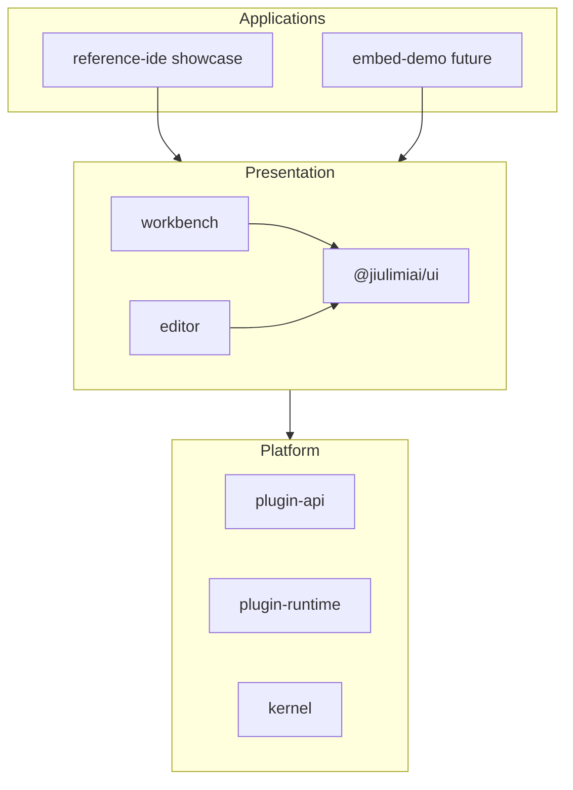

# ADR 007: Presentation layer (`@jiulimiai/ui`) and Embed-First strategy

## Status

Accepted — Phase 7

## Context

Molecule Next migrated from legacy BEM CSS (`mo-*` + `styles.css`) to a shared presentation layer:

- `@jiulimiai/ui` — Craft OKLCH tokens, shadcn/Radix primitives, Craft-style icons, IDE shell components
- Tailwind CSS v4 scanned at the host app (`apps/reference-ide/src/index.css`)
- Reference IDE serves as the official capability showcase, not a standalone terminal product

Strategic decisions (2026-06):

1. **Primary audience:** Embed-first — B2B integrators embedding the IDE shell; Reference IDE validates framework capabilities.
2. **Terminal strategy:** Frozen — maintain `@jiulimiai/terminal-host` built-in shell + xterm UI; no PTY/WebSocket terminal backend in roadmap unless strategy changes.

## Decision

### Package layering

### Rules

1. **Plugins import `@jiulimiai/ui`** for shared UI (icons, buttons, FileTree, etc.) — not shadcn or lucide directly.
2. **Host apps import `@jiulimiai/ui/styles/tokens.css`** and configure Tailwind `@source` for packages they bundle.
3. **`@jiulimiai/workbench` / `@jiulimiai/editor`** depend on `@jiulimiai/ui`; they do not ship standalone CSS files.
4. **Terminal** remains `@jiulimiai/terminal-host` + `plugin-terminal`; theme sync via CSS variables only — no `TerminalBackend` abstraction.
5. **Phase 8 deliverable:** `createMoleculeIDE()` / `<MoleculeIDE />` embed SDK with documented props (`plugins`, `workspace`, `theme`, `layout`).

### Theme system

- Craft OKLCH 6-color tokens in `packages/ui/src/styles/tokens.css`
- 15 color presets + system/light/dark mode via `plugin-themes`
- Persistence: `localStorage molecule:theme` + workspace `.molecule/settings.json`

## Consequences

- Positive: Consistent visual language; embed hosts can theme via CSS variables.
- Positive: Clear product focus (framework SDK over terminal product).
- Negative: Integrators must include Tailwind v4 scan in their Vite/host config.
- Negative: Real shell/PTY deferred indefinitely while terminal strategy is frozen.

## Related

- [DESIGN-ROADMAP.md](../DESIGN-ROADMAP.md) — Phase 7–8
- [ADR 005](005-phase6-host-packages.md) — Git/terminal host boundaries (terminal scope unchanged)
